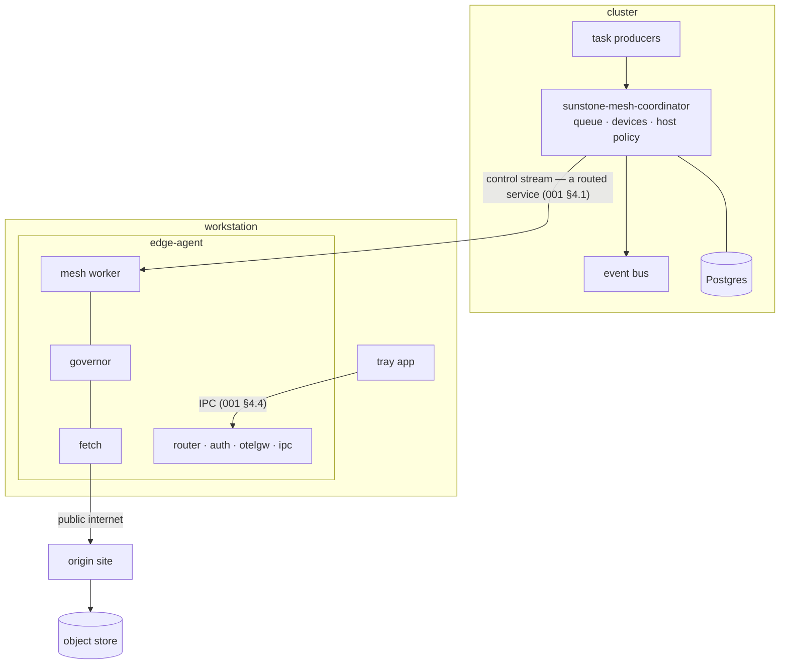

# Distributed downloader mesh

## 0. Summary {#sec-0}

Spec 001 describes an agent that is purely *outbound*: local processes ask it
for credentials or a proxied response, and it brokers access to Sunstone cloud
resources. This spec adds the opposite direction. A **coordinator** running in
the cluster dispatches small units of work to enrolled workstations, and the
agent executes them.

The first — and for now only — unit of work is **fetch a URL and put the bytes
in object storage**. The reason to do this on a laptop rather than in a
datacenter is that datacenter IP ranges are widely bot-blocked. A pool of
residential and office egress addresses gets through where a GKE node does not,
and when one address does get blocked, the coordinator can retry the same URL
from a different one.

Two constraints shape everything below. First, these are colleagues' work
machines, so the agent must never surprise its host: bandwidth is capped and
visible, and the human can opt out at any time. Second, the agent runs on a home
LAN behind a consumer router, so a URL that redirects to a private address turns
the agent into a proxy into someone's house. Both get first-class treatment
rather than a hardening pass later.

## 1. Goals {#sec-1}

> **Amends spec 001 §1.** Adds a fourth role to the agent. This spec narrows
> none of the goals in 001 §1. (001 §1 goal 1 was separately rewritten by 001's
> own PKCE reconciliation, which this spec does not depend on either way.)

1. **Mesh worker.** The agent accepts dispatched fetch tasks from the
   coordinator, executes them from the workstation's own egress address, and
   reports the outcome.
2. **Fleet-wide fetch policy.** The coordinator, not the agent, owns retry,
   per-host politeness, and which device fetches what — so blocking behaviour
   observed on one device informs every other.
3. **Host-first resource use.** The human owning the machine can cap the
   agent's bandwidth and suspend mesh participation without touching the
   agent's other functions, and can see what it is doing.
4. **Remote remediation.** The agent can be upgraded and reconfigured from the
   control plane, because chasing colleagues to reinstall a binary does not
   scale.

**Non-goals.** Fetching anything that needs a logged-in browser session,
solving CAPTCHAs, or otherwise defeating a site that has deliberately decided
to exclude us — a `Blocked` outcome is reported and the task fails. Running on
hardware Sunstone does not own. Distributing any work other than fetches.

## 2. Topology and roles {#sec-2}

The coordinator never dials a workstation. Laptops sleep, roam between
networks, and sit behind NAT; an inbound-connection design would spend its life
retrying. The agent dials out and holds the stream open.

Bulk download traffic goes **straight from the workstation to the origin and
then to object storage** over the public internet. It does not pass through the
coordinator or through any tunnel. Only the control stream — leases, results,
heartbeats — uses the routed path in §4.1, and it is small.
